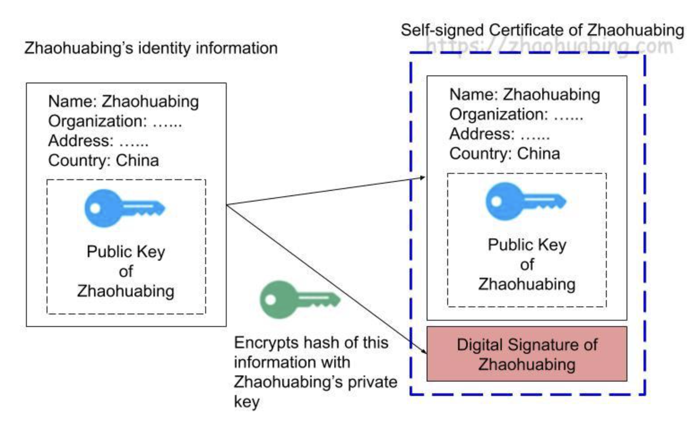

Check the article, very useful:
[digital certificate](https://www.zhaohuabing.com/post/2020-03-19-pki/)

A self signed certificate:

Use CA's private key to sign:

Process for a e2e case:

签名不是加密哦，原文还在哦